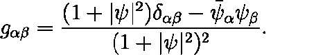
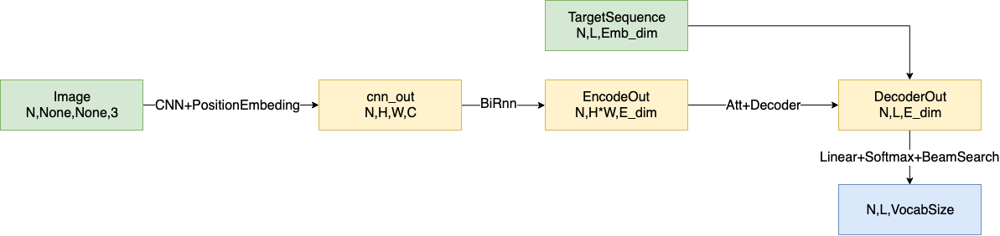

# Img2Katex模型说明

## 简介

本仓库代码实现将公式图像转换为katex输出，是整个ocr项目中，该部分是最难的一部分，该仓库是对原有项目该功能的升级。

**该代码目前存储在73服务器，项目地址为`/home/xiaofeng/code/image2katex`，数据集地址为`/home/xiaofeng/data/image2latex`**

## 项目演示

输入公式图像数据

<hr>



预测输出`latex`

```bash
g _ { \alpha \beta } = \frac { ( 1 + | \psi | ^ { 2 } ) \delta _ { \alpha \beta } - \bar { \psi } _ { \alpha } \psi _ { \beta } } { ( 1 + | \psi | ^ { 2 } ) ^ { 2 } }
```

<hr>

本代码主要参考的是https://guillaumegenthial.github.io/image-to-latex.html该文章对应的代码。

- 输入的是公式的图像，进行CNN特征提取，在CNN中使用elu(指数线性单元)激活函数，一点需要特别注意，在CNN最后一层中加入位置编码，这里参考的是transformer中的位置编码实现。
- 使用CNN对图像进行特征提取之后，得到的数据维度为NHWC，将数据维度进行转换，在高度方向上使用双向RNN编码，之所以使用高度方向上进行双向RNN操作是因为输入的图像是一种长条形图片，在高度方向进行RNN是为了找到宽度方向上的前后联系。
- 对训练数据集的目标label要进行处理，首先分词得到每个katex单元，确定整个词表的大小；此后，对目标label头部插入START标志，尾部插入END标志，词表中不存在的katex单元使用UNKNOWN标志，统计整个训练集，使用kmeans计算bucket的尺寸，并对训练集中的图像进行resize和padding，将相近的尺寸转换至对应的bucket的尺寸，在训练的时候，从bucket中提取数据凑成一个bucket进行训练，对目标序列进行padding，使用PAD标识符对齐目标序列。
- 接下来是decoder阶段，使用的是Attention机制的decoder的解码机制，并且提供了greedy解码和binary search的解码方式，使用集束搜索可以得到更优解(贪婪搜索可以看做是搜索窗口为1的集束搜索)。

整个实现的pipeline如下图所示

<hr>



<hr>

对流程图进行解释说明

对于输入的图片使用CNN网络进行特征提取，之后在高度方向上使用双向RNN，找到数据的前后依赖关系，对数据进行维度转换，之后使用GRU+attention进行解码器设计，对于Attention的计算方式可以参考相关博客文献[深度学习-Python-tutorial-LSTM-GRU-Attention](http://xiaofengshi.com/2018/11/27/%E6%B7%B1%E5%BA%A6%E5%AD%A6%E4%B9%A0-Python-tutorial-LSTM-GRU-Attention/)。

## 本项目代码说明

本项目中包含三个模型，包含im2katex，errorchecker，dismodel分别实现图像预测生成katex，预测katex错误语法纠正，和预测katex语法错误判别器。

对于im2katex和errorchecker均可以使用项目文件夹下的makefile文件进行训练和测试。

### 参数说明

- data_type: 

  使用哪种数据集训练得到的权重，目前有'handwritten'—手写体图片训练集, 'original'—印刷体图片训练集, 'merged'—二者合并的训练集，默认使用二者合并的训练集。

- model_type

  运行那个程序，目前有两个模型，一个是im2katex，也就是上文所说的输入公式图片，输出预测的katex表达式；另一个是error，这个是对im2katex的改进(预测的katex存在缺失会导致katex无法渲染生成图片，对该类错误的图片使用nmt的方式进行错误纠正)，经过训练，效果不好，目前已经废除，暂不使用。

- mode

  何种网络模型运行方式，可选参数为'trainval', 'test', 'val', 'infer’

- encoder_type

  在im2katex模型中的encoder的方式，可选为'Augment','conv'，分别对应的是是否数据增强，如果参数为`Augment`则在数据输入时使用数据增强，如果是`conv`使用默认的数据输入

### 测试

目前项目对于img2katex已经训练完成，可以使用makefile文件进行测试

#### 命令行测试

命令行测试代码为

```bash
make im2katex-inference
```

根据提示在命令行输入待测试图片的地址或者待测试的文件夹位置

#### web端测试

目前的代码中提供了web端测试页面

启动测试代码

```
make server
```

页面如下，每行对应的内容分别为：

1. inputimage：输入的图片
2. processimage：预处理之后的图片
3. latexpredict：预测生成的latex
4. renderedimage：使用预测的latex渲染生成的图片


<hr>

### 训练

目前im2katex使用的数据是网上的开源数据集，包含两种数据，一种为印刷体公式图片，数量大约为10w，另一个为手写体公式图片，数量大约为7w。将两个数据集合并，可以组成混合数据集。

#### 训练模型

如果使用当前已经准备好的标准格式数据集，直接使用make文件下的命令,

如果训练标准数据集

```bash
make im2katex-trainval-ori
```

如果对标准数据集进行增强

```bash
make im2katex-trainval-aug
```

### 训练自己的数据

#### 数据集预处理

首先对数据集的label进行预处理，将label中的katex进行分词，可以使用[./data/process_im2latex/run_formula_normal.sh](./data/process_im2latex/run_formula_normal.sh)下的命令

对数据提取bucket，resize，padding等操作，相关处理程序代码为[./data/build_imglatex_data.py](./data/build_imglatex_data.py)

最后得到的数据为numpy格式，按照不同的bucket size存储，内部存储着图像名和对应的label，并且生成了包含数据集的一些映射关系：词表字典，索引与字符转换关系等。

如果要训练自己的数据，需要对数据集进行预处理。

#### 训练模型

在准备好数据之后，同样使用make命令进行训练模型。

# errorchecker模型说明

该模型的设计初衷是，使用im2katex经过训练测试之后，loss已经非常小，bleu和edit distance衡量指标已经很高，但是如果使用预测的katex能否生成图像为衡量指标，预测生成率仅为50%，也就是说，虽然预测时katex和label已经非常相似，但是对于严格的ketex结构，存在少量的差异也会导致渲染图片失败，因此errorchecker是按照nmt的思路设计了一个机器翻译模型，以预测的字符串作为输入，以label作为输出，训练nmt模型，并且使用的是im2katex预训练之后得到的embeding向量，由于对于一个正确的label存在多个错误的输入，这是一种多对一的映射，因此经过短期训练之后发现nmt模型无法收敛，该模型已经放弃

# disMode模型说明

同样是对原来的im2katex的进一步优化，原来的loss已经很小，loss无法下降，那么增加loss是否可以使模型训练继续下去？答案是可以的。目前的loss来源于预测的katex字符和label之间的交叉熵损失，那么借鉴对抗生成网络，现在的im2katex可以看做是生成器，那么设计一个判别器来判断预测生成的katex是否可以生成图像，这就为模型引入了一个损失。

在现有im2katex的基础上进行预测，得到预测的katex和同等数量的label列表，接下来使用能否渲染生成图片作为衡量指标对预测的katex进行过滤，只保留无法生成的图片的预测katex，并且保留对应的label，判别器对该katex进行判断，如果无法生成katex，判别器预测输出为0，如果输入的是label，那么判别器预测输出应该为1，根据对抗生成网络的损失函数，实际就是价差上损失，对判别器进行训练，如果判别器训练收敛之后，可以将该判别器加入到im2katex之中，在im2katex中dismodel为测试模式，不更新参数。

目前思路：

对于整个项目，输入时公式的图片，我们想要的是准确的katex输出。在im2katex中输入图片，得到预测的katex，计算预测katex和label之间的交叉熵损失$\sum Alog(y)+(1-A)log(1-y)$，并且预测的katex输入dismodel，计算dismodel判断katex为1的损失$mean(-\log(D(katex)))$

在disModel中，使用的是TCN网络(具体的实现可以参考https://github.com/Songweiping/TCN-TF或者https://github.com/locuslab/TCN)，对输入的序列进行3层的空洞卷积，之后经过线性变换得到输出。

## 参考代码

*  **OpenAI’s Requests For Research Problem**[Open AI-question source](https://openai.com/requests-for-research/#im2)
*  
	* [Official resolution](http://lstm.seas.harvard.edu/latex/)
	* [Official repo-torch](https://github.com/harvardnlp/im2markup)
	* [Source paper](https://arxiv.org/pdf/1609.04938v1.pdf)
* [Seq2Seq for LaTeX generation](https://guillaumegenthial.github.io/image-to-latex.html)
* [Original model repo-网络模型TF](https://github.com/ritheshkumar95/im2latex-tensorflow)
* [Another model repo--网络模型TF](https://github.com/baoblackcoal/RFR-solution)
* [知乎解释](https://zhuanlan.zhihu.com/p/25031185)
* [Dataset ori repo-数据集制作](https://github.com/Miffyli/im2latex-dataset)